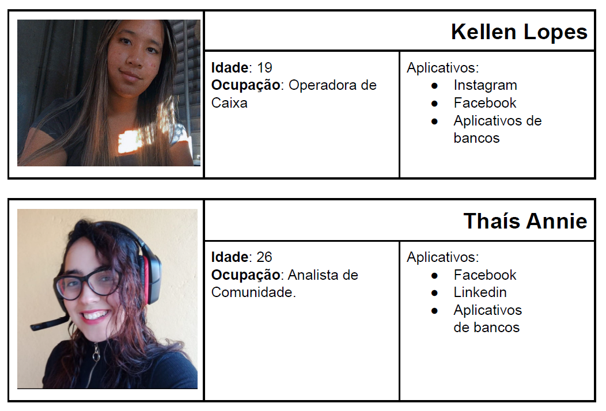
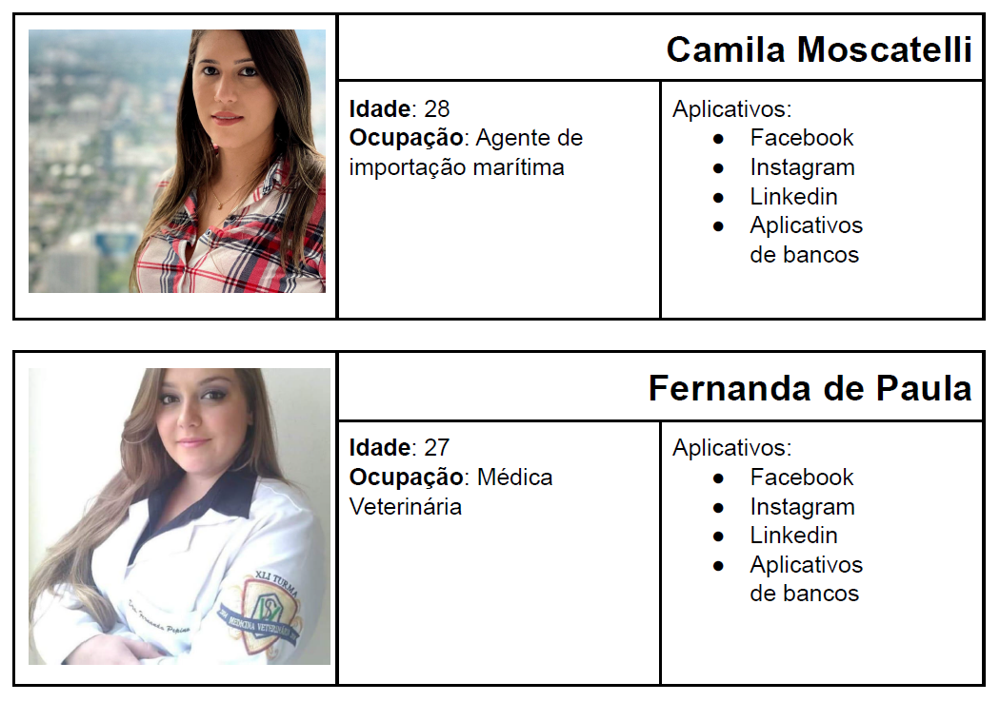

# Especificações do Projeto

A definição exata do problema e os pontos mais relevantes a serem tratados neste projeto foi consolidada com a participação dos usuários em um trabalho de imersão feito pelos membros da equipe a partir da observação dos usuários em seu local natural e por meio de entrevistas. Os detalhes levantados nesse processo foram consolidados na forma de personas e histórias de usuários.

## Personas

As personas levantadas durante o processo de entendimento do problema são apresentadas nas Figuras que se seguem.

## Histórias de Usuários

A partir da compreensão do dia a dia das personas identificadas para o projeto, foram registradas as seguintes histórias de usuários:

|Eu como... [PERSONA]|Quero/Desejo ... [O QUE]|...para... [POR QUE]     |
|--------------------|------------------------------------|----------------------------------------|
|Kellen Lopes  | Serviço de saúde gratuito além do SUS para pequenos atendimentos           | para desafogar o SUS e ter atendimentos mais rapidamente               |
|Kellen Lopes       | Ter conhecimento das ofertas deste tipo de serviço                 | gastar menos tempo procurando as unidades de atendimento |
|Kellen Lopes  | Poder pesquisar por categorias, regiões e especialidades médicas           | facilitar e agilizar a procura de pontos de atendimento cadastrados no projeto    |
|Thais Annie       | Fazer comentários das clínicas e reportar minha opinião                 | ajudar outras pessoas na escolha dos pontos de atendimento |
|Thais Annie  | Ter acessos aos meus laudos médicos            | para facilitar o atendimento e diagnóstico em uma outra clínica               |
|Camila Moscatelli       | Poder marcar uma consulta 100% on-line                 | facilitar e agilizar o processo de agendamento de horários |
|Camila Moscatelli  | Poder utilizar o site tanto no desktop quanto no celular           | poder marcar minha consulta não importando onde eu esteja               |
|Fernanda de Paula       | Poder cadastrar novos pontos de atendimento diretamente no site                 | facilitar a inclusão de novos pontos de atendimento |
|Fernanda de Paula  | Classificar a urgência           | facilitar o atendimento, classificando as prioridades               |

## Requisitos do Projeto

O escopo do projeto é definido por meio dos requisitos funcionais que descrevem as possibilidades de interação dos usuários e dos requisitos não funcionais que descrevem os aspectos que o sistema deverá apresentar, de modo geral. Estes requisitos são apresentados a seguir.

### Requisitos Funcionais

A tabela abaixo apresenta os requisitos do projeto, identificando a prioridade em que os mesmos devem ser entregues.

|ID    | Descrição do Requisito  | Prioridade |
|------|-----------------------------------------|----|
|RF-001| O site deve apresentar na página principal a lista de clínicas cadastradas no projeto | ALTA | 
|RF-002| O site deve apresentar, para cada clínica suas especialidades (fonoaudiologia, fisioterapia, odontologia etc.)   | ALTA |
|RF-003| O site deve permitir ao usuário visualizar os horários disponíveis de cada clínica  | ALTA | 
|RF-004| O site deve oferecer um filtro para o  paciente procurar a clínica por regiões ou especializações   | MÉDIA |
|RF-005| O site deve oferecer um canal de contatos para que o paciente possa marcar sua consulta 100% online | ALTA | 
|RF-006| O site deve permitir que o paciente consulte, atualize e gerencie seu cadastro no sistema   | MÉDIA |
|RF-007| O site deve permitir que o paciente gerencie seu perfil adicionando informações para agilizar seu atendimento | BAIXA | 
|RF-008| O site deve permitir que o paciente avalie e faça comentários sobre as clínicas em que consultou   | BAIXA |
|RF-009| O site deve permitir verificar as avaliações (notas) e comentários de outros usuários | BAIXA | 

### Requisitos não Funcionais

|ID     | Descrição do Requisito  |Prioridade |
|-------|-------------------------|----|
|RNF-001| O site deve ser publicado em um ambiente acessível publicamente na Internet (Repl.it, GitHub Pages, Heroku); | ALTA | 
|RNF-002| O site deverá ser responsivo permitindo a visualização em um celular de forma adequada |  ALTA |
|RNF-003| O site deve ter bom nível de contraste entre os elementos da tela em conformidade  | MÉDIA | 
|RNF-004|O site deve ser compatível com os principais navegadores do mercado (Google Chrome, Firefox, Microsoft Edge) |  ALTA |

## Restrições

As questões que limitam a execução desse projeto e que se configuram como obrigações claras para o desenvolvimento do projeto em questão são apresentadas na tabela a seguir:

|ID| Restrição                                             |
|--|-------------------------------------------------------|
|RE-01| O projeto deverá ser entregue no final do semestre letivo, não podendo extrapolar a data de 06/12/2021. |
|RE-02| O aplicativo deve se restringir às tecnologias básicas da Web no Frontend        |
|RE-03| A equipe não pode subcontratar o desenvolvimento do trabalho.        |
