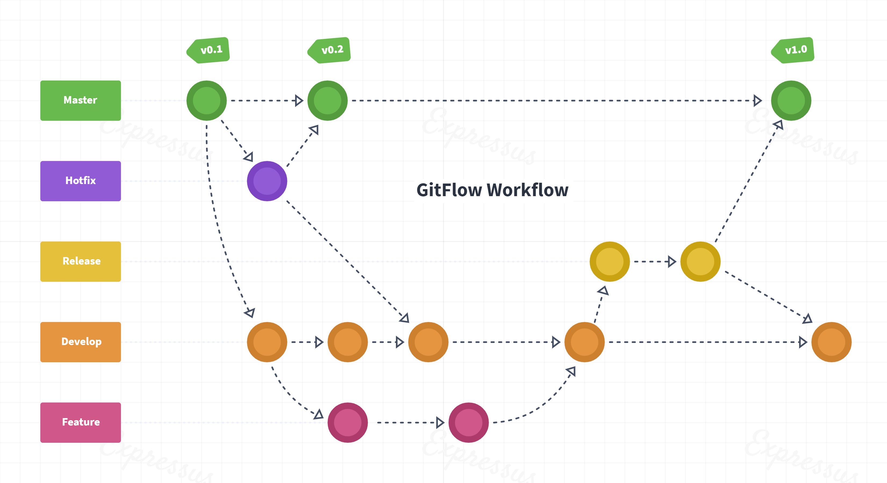
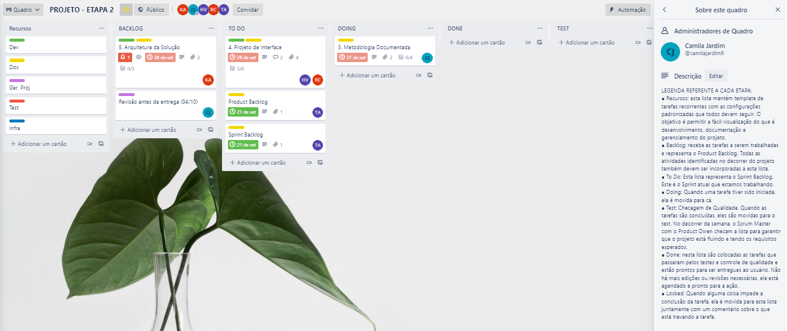
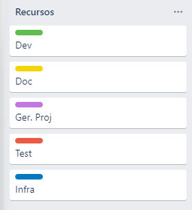

# Metodologia

A metodologia abrange as definições de ferramentas utilizadas pelos integrantes do grupo. O mesmo vale para manutenção dos códigos, demais artefatos e organização da equipe na execução das tarefas destinadas.
 

## Relação de Ambientes de Trabalho

Os artefatos do projeto são desenvolvidos por diversas plataformas e a relação dos ambientes com seu propósito são apresentados na tabela abaixo:

|Ambiente     | Plataforma  |Link de acesso |
|-------|-------------------------|----|
| Repositório de código fonte | GitHub | https://github.com/ICEI-PUC-Minas-PMV-ADS/pmv-ads-2021-2-e1-proj-web-t2-ads_2021_02_e1_grupo_03 | 
| Documentos do projeto | Google Drive | https://docs.google.com/document/d/19-BGkpDt_ujMdmFL179UxsR17zAyIm-d/edit?usp=sharing&ouid=103254162993490802223&rtpof=true&sd=true |
| Projeto de Interface e  Wireframes | Figma | https://www.figma.com/team_invite/redeem/Zv8Cev7IK4Ce6CR3GkDtVu | 
| Gerenciamento do Projeto | Trello |  https://trello.com/b/M8hDmc5b |
 

## Gestão de Código Fonte

Para gestão do código fonte do software desenvolvido pela equipe, o grupo utiliza um processo baseado no Git Flow abordado por Vietro (2015), mostrado na Figura 1.

Desta forma, todas as manutenções no código serão realizadas em *branches* separados mas que se relacionam entre si, identificados como Master, Hotfix, Release, Develop e Feature.

 
**Figura 1** - Fluxo de controle do código fonte no Expressus B

 

## Gerenciamento do Projeto

A equipe está empregando métodos ágeis e escolheu o SCRUM como base para o desenvolvimento do processo.

A equipe está organizada da seguinte maneira:

* **Scrum Master:** 
   - Camila Jardim
* **Product Owner:** 
   - Tarcísio Almeida
* **Equipe de Desenvolvimento:**
   - Kamila Clemente
   - Hugo Vinicius Damasceno
* **Equipe de Design:**
   - Rafael Mautone

Para organização e distribuição das tarefas do projeto, a equipe está utilizando a ferramenta Trello para estruturação das atividades que serão executadas, conforme disposição abaixo:

* **Recursos:** esta lista mantém um template de tarefas recorrentes com as configurações padronizadas que todos devem seguir. O objetivo é permitir a fácil visualização do que é desenvolvimento, documentação e gerenciamento do projeto;
* **Backlog:** recebe as tarefas a serem trabalhadas e representa o Product Backlog. Todas as atividades identificadas no decorrer do projeto também serão incorporadas a esta lista;
* **To Do:** Esta lista representa o Sprint Backlog. Este é o sprint atual que estamos trabalhando;
* **Doing:** Quando uma tarefa tiver sido iniciada, ela será movida para este quadro;
* **Test:** Checagem de qualidade. Quando as tarefas são concluídas, elas são movidas para o Test. No decorrer da semana,  o Scrum Master com o Product Owner  checam a lista para garantir que o projeto está fluindo e seguindo os requisitos esperados;
* **Done:** nesta lista são colocadas as tarefas que passaram pelos testes e controle de qualidade e estão prontas para entrega ao usuário. Não há mais edições ou revisões necessárias, ele está agendado e pronto para a ação.
* **Locked:** Quando alguma coisa impede a conclusão da tarefa, ela é movida para esta lista juntamente com um comentário sobre o que está travando a tarefa.

O quadro kanban do grupo no Trello está disponível através da URL https://trello.com/b/M8hDmc5b, conforme representação na Figura 2.

 
**Figura 2** - Tela do kanban utilizada pelo time

 

A tarefas são etiquetadas em função da atividade e seguem o seguinte esquema de cores/categorias:

* Documentação

* Desenvolvimento

* Infraestrutura

* Testes

* Gerência de Projetos
 
 
 
 
 

<b>Figura 3</b> - Esquema de etiquetas das tarefas

