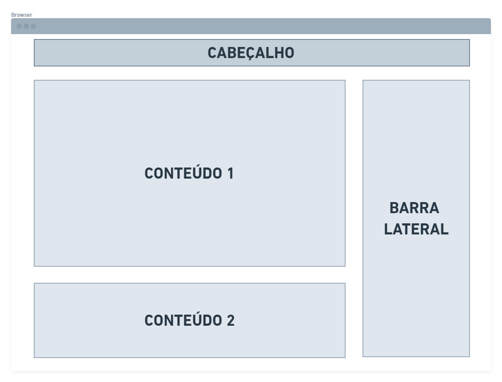

# Projeto de Interface

Em relação às pautas abordadas para a montagem da interface do sistema, estabelecemos o foco em questões como usabilidade, agilidade e acessibilidade. Com isso, o projeto conta com uma identidade visual padronizada em todas as telas que são projetadas para funcionamento em desktops e dispositivos móveis.
 

## Fluxo do Usuário

O *User Flow*, mostrado na Figura 4, foi desenvolvido para permitir que se possa mapear o fluxo de telas do presente projeto.

 
**Figura 4** - Fluxo do Usuário

 

O diagrama apresentado na Figura 5 mostra o fluxo de interação do usuário pelas telas do sistema. As telas deste fluxo são detalhadas individualmente no tópico *Wireframes*.

 
**Figura 5** - Fluxo de Telas do usuário

 

## Wireframes

De acordo com o fluxo de telas do projeto, conforme apresentado na Figura 5, detalhamos as telas do sistema que foram estruturadas seguindo o escopo abaixo:

* **Cabeçalho** - local no qual serão dispostos elementos fixos de identidade (logo) e navegação principal do site (menu da aplicação);
* **Conteúdo** - apresenta o conteúdo da tela em questão;
* **Barra lateral** - apresenta os elementos de navegação secundária, geralmente associados aos elementos do bloco de conteúdo.

 
**Figura 6** - Estrutura do site

 

### Tela - Home Page

A tela de home page exibe informações importantes e diretas sobre as buscas de alta prioridade.

Com base na estrutura padrão, o bloco *‘Conteúdo 1’* dispõe da opção para busca de clínicas que ofereçam o atendimento médico desejado, direcionando assim, o usuário para
outra página. O bloco *‘Conteúdo 2’*, apresenta uma introdução sobre o site e sua finalidade.

Já o bloco *‘Barra Lateral’* exibe três elementos de notícias/atualizações sobre as clínicas cadastradas.

 
**Figura 7** - Tela Inicial: Busca de clínicas, introdução e notícias

 

### Tela - Notícias

A tela *‘Notícias’* apresenta sete campos, sendo seis de notícias/informações mais recentes e um campo maior onde a notícia selecionada é exibida em destaque.

 
**Figura 8** - Tela da Notícias

 

### Tela - Contatos

A tela *‘Contatos’* apresenta um mapa de Belo Horizonte a partir da API do Google Maps que é utilizada pelo sistema e, ao lado, são solicitados dados como o bairro e o tipo de
tratamento que o usuário procura. Após a inserção dos dados solicitados são exibidos os resultados da pesquisa.

 
**Figura 9** - Tela de contatos

 

### Tela - Cadastro

Sendo interesse do usuário ter um cadastro no site, ele poderá se registrar. Após a realização do cadastro, o usuário poderá receber as últimas notícias e informações sobre as
clínicas, além de conseguir postar comentários sobre as clínicas.

 
**Figura 10** - Tela de Cadastro

 

### Tela - Clínicas Parceiras

Na tela *‘Parceiros’* é possível visualizar todas as clínicas parceiras e coletar dados como: contato, email e especialidades ofertadas.

 
**Figura 11** - Tela de Parceiros

