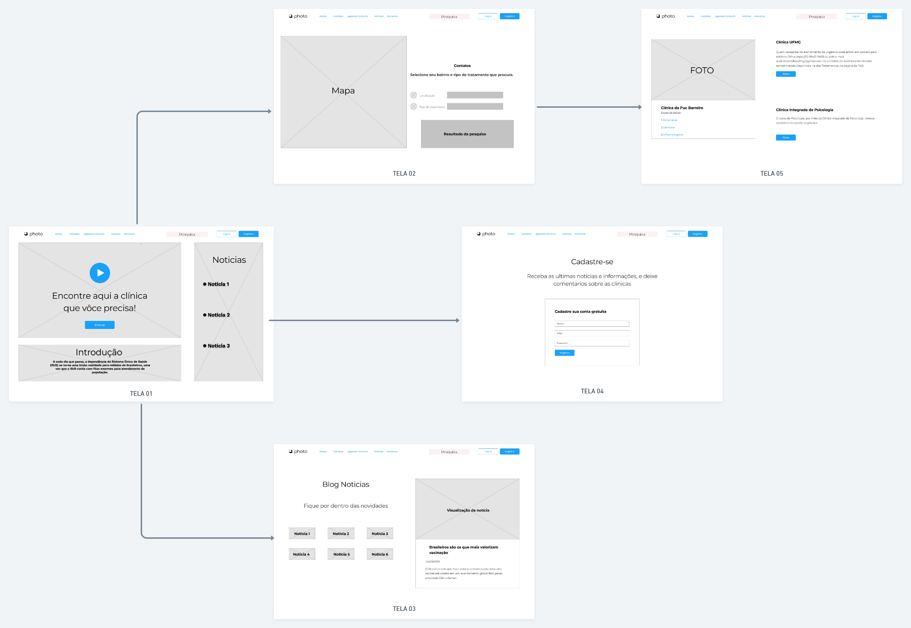

# Arquitetura da Solução

Nesta seção são apresentados os detalhes técnicos da solução criada pela equipe, tratando dos componentes que fazem parte da solução e do ambiente de hospedagem da solução.
 

## Diagrama de componentes

Os componentes que fazem parte da solução são apresentados na Figura 12, abaixo:

![Figura12] 
**Figura 12** - Arquitetura da Solução

 

A solução implementada conta com os seguintes módulos:

* **Navegador** - Interface básica do sistema;
* **Páginas Web** - Conjunto de arquivos HTML, CSS, JavaScript e imagens que implementam as funcionalidades do sistema;
* **Local Storage** - armazenamento mantido no Navegador, onde são implementados bancos de dados baseados em JSON. São eles:
  - **Cadastro** - seção para cadastramento de visitantes do site
  - **Histórico** - registro de clínicas pesquisadas
* **Mapa das clínicas (Google Maps API)** - plataforma de acesso ao mapa das clínicas exibidas no site;
* **Hospedagem** - local na Internet onde as páginas são mantidas e acessadas pelo navegador.

A Figura 13, também apresentada no tópico *Wireframes* do Item 4 - Projeto de Interface (Imagem 5), ilustra o fluxo do usuário em nossa solução. Assim que o usuário entra na plataforma, a tela inicial (Tela 1) é exibida, na qual há uma pequena introdução sobre o propósito do site e ao link para acessar as clínicas disponíveis, bem como ao link para o portal *‘Notícias’*.

Caso o usuário opte por clicar no link de acesso às clínicas, ele será redirecionado para a tela *‘Contato’* (Tela 2), na qual poderá visualizar o mapa das clínicas,de acordo com bairro que o usuário digitar no campo de pesquisa. Com o resultado da pesquisa, o sistema exibe a Tela 5 com as informações sobre a clínica pesquisada.

Caso o usuário opte por acessar o link *‘Notícias’*, ele é redirecionado para a Tela 3 e visualiza todas as notícias hospedadas no site.

Há ainda a opção de se cadastrar no site (Tela 4). Nesta tela o usuário informará seus dados cadastrais para que, posteriormente, seja direcionado à sua página de perfil.

 
**Figura 13** - Fluxo de Telas do Usuário

 

## Tecnologias Utilizadas

O site foi desenvolvido utilizando o framework *Scrum*, e possui capacidade de funcionar em diversos *browsers* Web, especialmente no Google Chrome, Mozilla Firefox e Microsoft
Edge.

O site foi implementado utilizando as linguagens de programação HTML, CSS e Java Script, através do editor de código fonte Visual Studio Code.
 

## Hospedagem

O site utilizará a plataforma do Heroku como ambiente de hospedagem do projeto. Ele será mantido no ambiente provisório da URL: https://pontosdeatendimentomedicobh.herokuapp.com. Cumpre observar que o site ainda não foi hospedado no link acima referido.

A publicação do site no Heroku é feita por meio de uma submissão do projeto (push) via Git para o repositório remoto que se encontra no endereço: https://github.com/ICEI-PUC-Minas-PMV-ADS/pmv-ads-2021-2-e1-proj-web-t2-ads_2021_02_e1_grupo_03
