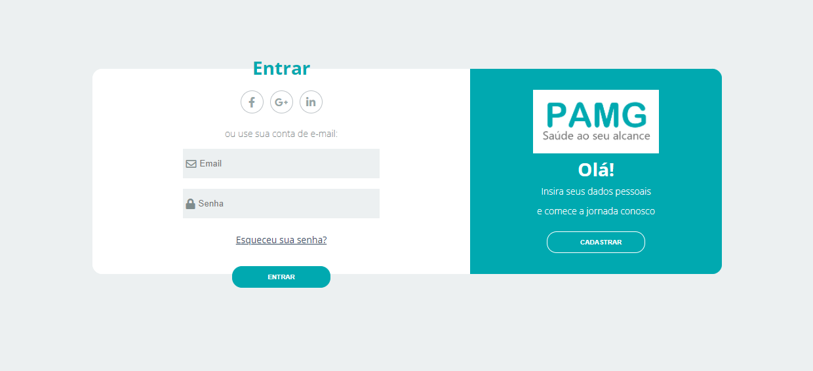

# Template padrão do site

O padrão de layout a ser utilizado pelo site tem correspondência ao projeto de Interface elaborado anteriormente na Figura 6 e que segue abaixo na Figura 14.

 
**Figura 14** - Estrutura do Site

 

O template criado está disponível no site e é composto pelos seguintes layouts:
* Tela Home Page
* Tela de Cadastro / Login

A responsividade segue o padrão das media queries na linguagem CSS.
 

## Tela Home Page

Essa é a tela que abrange todas as visualizações iniciais do site, direciona para a tela de cadastro e login, e dá acesso às notícias no box lateral.

 
**Figura 15** - Home Page

 

## Tela de Cadastro / Login

Esse layout é utilizado no cadastro / login do usuário, conforme se verifica nas Figuras 16 e 17, abaixo.

 
**Figura 16** - Criar Conta

 
**Figura 17** - Entrar

