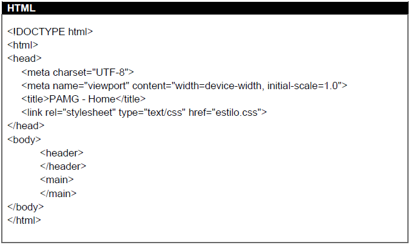

# Funcionalidades do Sistema

Nesta etapa, a funcionalidade do sistema abrange o cadastramento do usuário no site e seu respectivo login, assim como o acesso às notícias do box lateral. As orientações de cadastro e login são apresentadas na sequência.
 

## Tela Home Page

A tela Home Page, apresenta o botão Login/Registro, no qual dá a opção ao usuário para se cadastrar ou logar no site. O usuário também pode optar por acessar as notícias do box lateral através do link ‘Leia mais’, conforme se verifica na Figura 18, abaixo.

 
**Figura 18** - Home Page

 

### Requisitos Atendidos

* RNF-001 - O site deve ser publicado em um ambiente acessível publicamente na Internet (Repl.it, GitHub Pages, Heroku);
* RNF-002 - O site deverá ser responsivo permitindo visualização em desktop na resolução mínima de 470px;
* RNF-003 - O site deve ter bom nível de contraste entre os elementos da tela em conformidade;
* RNF-004 - O site deve ser compatível com os principais navegadores do mercado (Google Chrome, Firefox, Microsoft Edge).

### Artefatos da funcionalidade

* index.html 
* estilo.css
* busca2.png
* fundo.png
* notica1.png
* notica2.png
* notica3.png
* pamg.png

### Estrutura de Dados

 

### Instruções de Acesso

1. Abra um navegador de Internet e informe a seguinte URL: https://icei-puc-minas-pmv-ads.github.io/pmv-ads-2021-2-e1-proj-web-t2-ads_2021_02_e1_grupo_03/index.html; 
2. A tela PAMG - Home Page é a primeira página exibida pelo site;
3. O usuário pode optar por clicar no botão Login / Registro, localizado na barra de Menu do site, caso em que será redirecionado para outra tela (instruções mais detalhadas abaixo);
4. O usuário também pode optar por ler uma das notícias presentes no Box Lateral, caso em que basta clicar no link Leia mais, que será redirecionado para o site em que a notícia está hospedada.
 

## Login/Registro

Ao clicar no botão Login / Registro, o usuário é direcionado para a tela de cadastro e tela de login. Na sequência ele informa seu nome, endereço de email e senha para se cadastrar e após, em seu login, informa o endereço de email e senha cadastrados anteriormente. Os dados informados pelo usuário são armazenados no LocalStorage com estruturas baseadas em JSON. Um exemplo da tela é apresentado nas Figuras 19 e 20, que se seguem.

 
**Figura 19** - Cadastro

 
**Figura 20** - Login

 

### Artefatos da funcionalidade

* login.html 
* style.css
* app.js
* pamg.png

### Estrutura de dados

 

### Instruções de Acesso

1. Abra um navegador de Internet e informe a seguinte URL: https://icei-puc-minas-pmv-ads.github.io/pmv-ads-2021-2-e1-proj-web-t2-ads_2021_02_e1_grupo_03/index.html; 
2. Clique em Login / Registro na tela principal;
3. Após, é só informar os dados (nome, e-mail e senha) e clicar em cadastrar.
